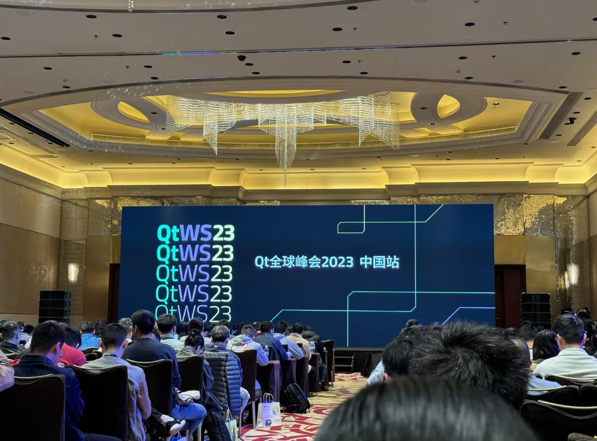
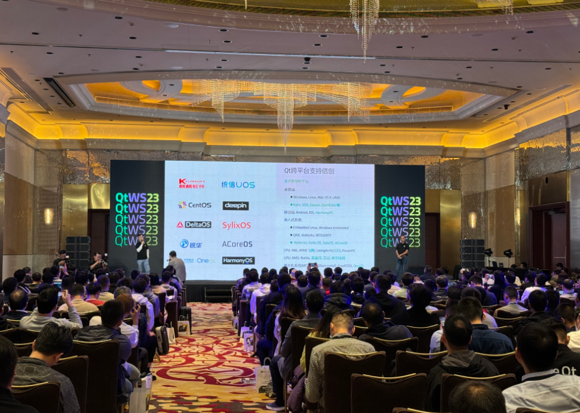
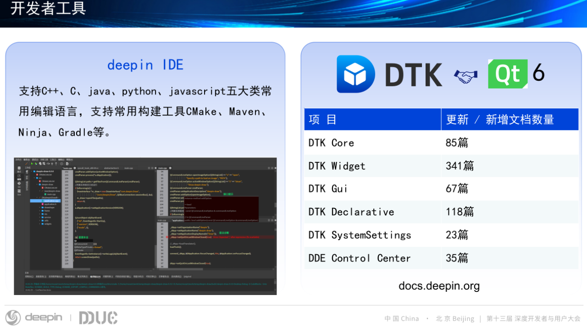
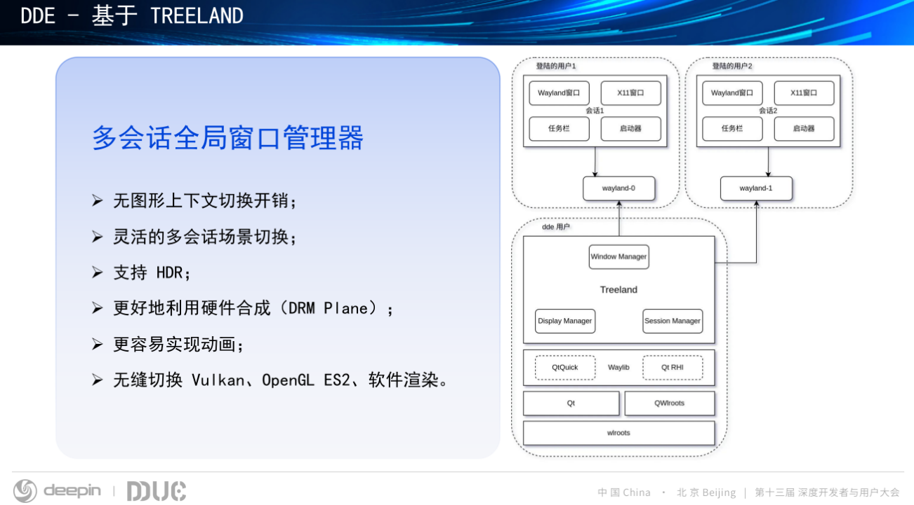
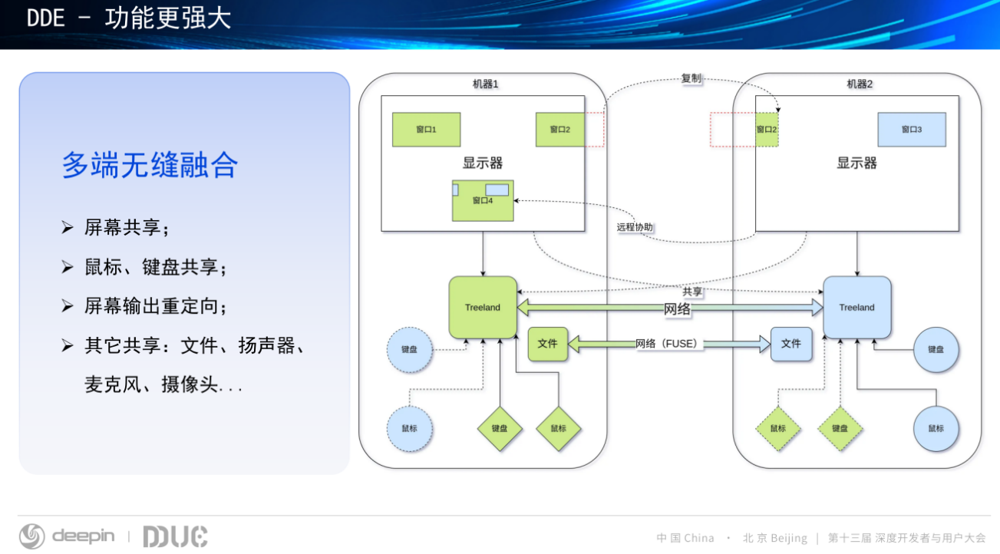

2023 年 11 月 21 日，Qt Group 在上海成功举办了“Qt 全球峰会 2023 中国站”，本次大会上发布了关于 Qt 开放框架与开发工具的战略，集中展示了最新的产品、解决方案，阐述了它们在优化软件跨平台开发全流程、提升研发团队跨职能协作效率以及加速产品迭代速度等方面的强大优势，同时大会上也分享了对于人工智能如何影响软件开发和测试的思考。

<!--more-->

Qt 作为 Linux 上最重要的开发工具之一，为中国信创产业的发展和创新提供了更多的可能性和选择。Qt Group 中国区负责人许晟在开幕致辞中表示，“Qt 中国作为 Qt Group 在中国的本地化团队，不仅通过源代码交付帮助本地企业实现软件的自主创新，还基于强大的跨平台能力支持针对本地操作系统和主流芯片的开发，为中国信创产业的发展和创新提供了更多的可能性和选择。

值得一提的是，deepin 已为 Qt社区贡献 100000+ 行代码，在贡献者中名列前茅。此外，deepin 社区也基于 Qt 开发了一整套简单且实用的通用开发框架 Development ToolKit（简称DTK），DTK 处于deepin系统中的核心位置。DDE 中超过30+组件，如浏览器、音乐、邮件等40余款原生应用全部使用 DTK 开发。为此，deepin（深度）社区在[ deepin 开发者平台](docs.deepin.org)上专门提供了在 deepin 上进行 Qt 开发的文档指导。

2023 年 11 月 18 日，deepin（深度）社区在北京798艺术中心举办了第十三届深度开发者与用户大会（Deepin Developer&User Conference，简称DDUC），在本次大会上，deepin社区也是公开了近一年在 DTK 和 Qt 这块的建设成果，目前 DTK 已正式适配 Qt6(6.4.2)，实现全面升级，相关介绍可以查看[《deepin（深度）宣布 deepin DTK 已完成基于 Qt6 的全面升级！》](https://www.deepin.org/zh/2023-9-7/)。

在本次 QtWS23 峰会上，Qt Group 资深开发工程师齐亮介绍了Qt Wayland 的最新进展。近些年 Linux 桌面发行版迁移到 Wayland 的趋势愈发明显，大有替代  X11 之势。Ubuntu 目前已经默认 Wayland 会话，GNOME 在 Wayland 支持这块一直走在 Linux 发行版的前列，且动作非常激进，目前 GNOME 桌面已经对外宣布将移除对 [X.Org](http://x.org/) 会话支持，默认使用 Wayland。X11 诞生于 1984 年，其设计符合当时的硬件环境、用户需求。随着技术的发展，出现了很多问题，特别是在桌面环境里面，需要 Xorg、窗口管理器、桌面环境组件三者之间进行复杂的交互、协作，导致演进困难。同时 X11 对于新特性的支持较差，Hi-DPI 体验糟糕，并且完全不支持 HDR。

事实上，在 2023 年5 月 17 日，deepin（深度）社区在推出 deepin V23 Beta 版的同时也已经支持了 Wayland 桌面环境。在 V23 beta 版本中，DDE 试验性的开启了 Wayland 的支持，允许用户在 Wayland 协议下的桌面工作环境启动 。在 deepin V23 中支持 Wayland，是 DDE 的一个非常重要的特性，也是今后 deepin 团队的工作重点，以实现 X11 版本的完全替代，提升 DDE 的优质体验，在 Wayland 桌面环境领域达到领先水平。

> DDE（deepin desktop environment）是deepin（深度）社区自主开发的美观易用、极简操作的桌面环境，主要由桌面、启动器、任务栏、控制中心、窗口管理器等组成，系统中预装了深度特色应用，它既能让您体验到丰富多彩的娱乐生活，也可以满足您的日常工作需要。

在此背景下，deepin 团队在今年 DDUC 大会了宣布将推出 Treeland 作为今后 DDE 所有功能开发的核心。Treeland 的底层基于 wlroots，并与 Qt Quick 进行了绑定，可同时兼顾两者的优点，wlroots 是 Wayland 生态中发展最迅速的开发库之一，具有功能丰富、演进速度快等优势，将其与 Qt Quick 结合则可以弥补 wlroots 在 GUI 能力方面的欠缺，极大的降低 Wayland 合成器的开发难度，实现 Vulkan、OpenGL ES2、软件渲染等多种渲染方式的无缝切换。

DDE 的新架构，将桌面环境各技术领域的组件进行了统一设计，允许桌面环境开发人员对其进行完全掌控，可轻松实现设备共享、多端无缝协同等高级功能。

未来，deepin（深度）社区将继续与最新技术保持同步，持续推进 DTK 的改进优化，也期待更多感兴趣的朋友加入到 deepin 开源社区中来，讨论更多内容，为推动生态发展贡献力量。