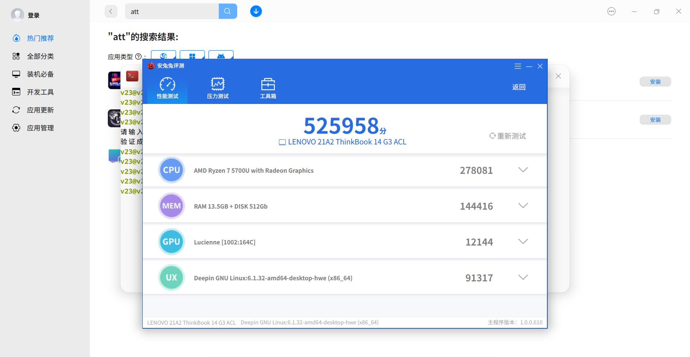
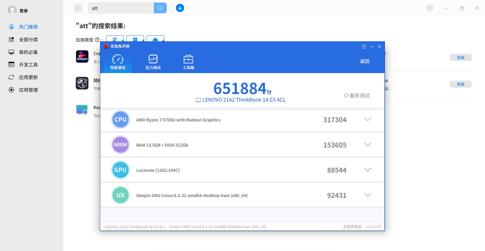
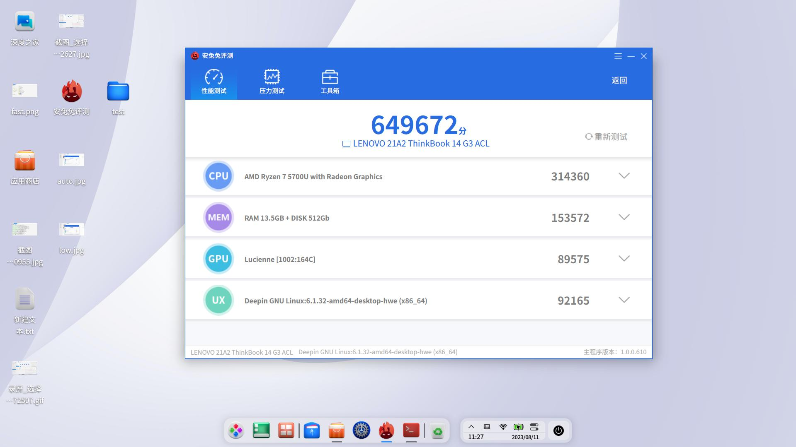
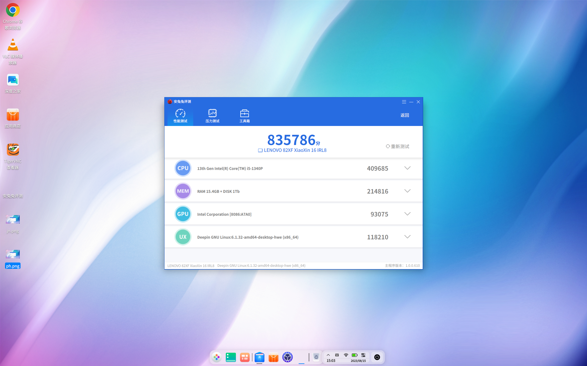
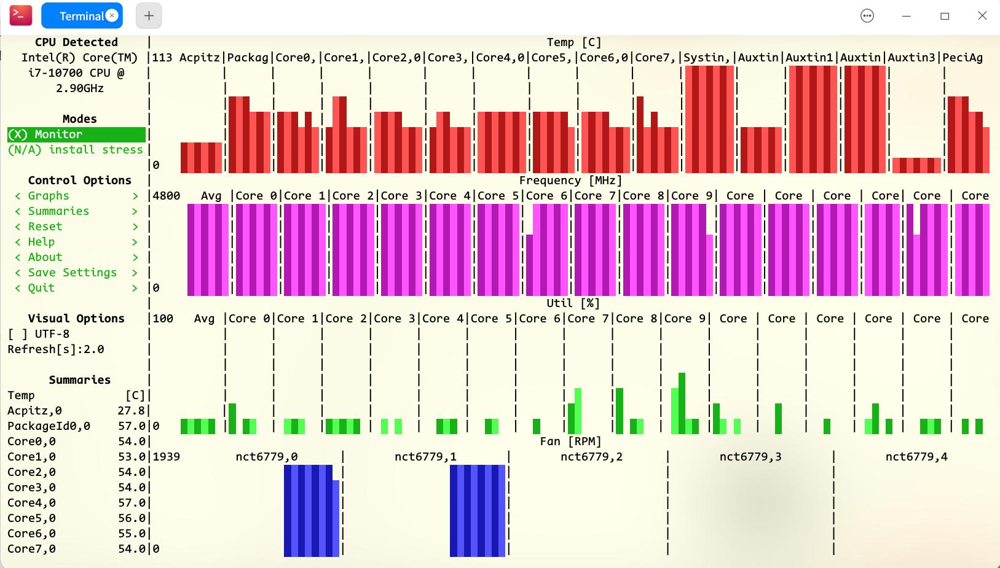

## 一、背景

 近期，我们收到用户反馈，在使用 deepin 系统过程中遇到了 CPU 功耗过高导致的设备发热、续航较差情况，而用户在这些负载场景下，CPU 的占用往往不高。为了解决这个痛点，统信软件开源社区中心特别成立专项计划，对于 deepin 的电源进行专项优化，本文旨在针对此问题根因进行分析于说明。

 在对电源进行专项优化之前，我们首先对 deepin 系统进行了深入的调查和分析，以了解其在负载场景下的实际运行情况。经过对 CPU 使用率和功耗的监测，我们发现了一个令人惊讶的事实：尽管在高负载场景下 CPU 的占用率不高，但其功耗却持续升高，最终导致设备发热并影响续航。也就是说，我们前期做的省电优化工作，不仅无效，还起了反作用（具体情况作者将在下文作出仔细说明）。

<!---more--->

## 二、问题

### 1. 内核

 最开始发现问题的地方在内核。有用户将我们的内核和 ubuntu 的内核进行对比后发现，虽然我们的系统和 ubuntu 系统的性能差不多，但是在发热和续航上，我们较 ubuntu 落后较多。有用户在 deepin 系统上使用 ubuntu 和其他开源 linux 发行版的配置文件分别编译内核，发现 deepin 的主要问题存在于发热控制之上。我们的测试同事高度重视这一社区反馈，遂对社区用户反馈的问题进行复现，佐证了这一现象。

 对于这种问题，我们立即联系了内核研发部的同事，并邀请部分对内核配置有一定研究的社区用户共同参与。在大家的合力排查下，我们发现，deepin v23 中提供的 HWE 内核存在部分 debug 和无用的内核选项被开启的情况，并且部分节电功能实际未能获得启用，这些都在一定程度上导致了 deepin v23 的续航表现不佳。

### 2. 系统

 在系统层面，我重新审视了 dde-daemon 提供的电源调度模块，并且对比内核文档提供的文件接口，分析我们用户使用的电源模式，发现其中存在可以优化的空间。这将是本文着重讲解的内容之一。

## 三、前置知识

### 1.ACPI

 ACPI 是 Advanced Configuration and Power Interface 的缩写，是一种计算机硬件和操作系统之间交换能源相关信息的接口规范。它定义了计算机硬件的能源相关信息，如电源供应器状态、设备功耗、设备功率因数等。ACPI 是操作系统控制计算机硬件能源管理的标准，同时也是硬件厂商和操作系统之间通信的标准。

 在 deepin 系统中，ACPI 负责处理计算机硬件的能源管理，它与 deepin 系统的电源管理模块进行交互，以实现对计算机硬件的能源管理。

 在分析系统层面的问题时，我们需要了解 ACPI 和电源管理模块的作用和功能，以及它们是如何协同工作的。在本文中，我们将会详细讲解 ACPI 的工作原理以及 deepin 系统中的电源调度模块工作模式，并提出可行优化建议。

 首先，让我们了解一下 ACPI 的工作原理。当计算机硬件发生电源变化时，ACPI 会收集硬件信息，并向操作系统发送电源请求。操作系统收到电源请求后，会根据用户配置自动调整各个硬件的电源策略。而 deepin 系统的电源模块则是帮助用户生成配置来调整 ACPI 的行为。所以在这一方面，我们能做的就是向 ACPI 提供合理的电源策略，在保证性能的同时，降低设备温度并提升续航表现。

### 2.平台电源配置

* **相关内核文档<**[https://docs.kernel.org/userspace-api/sysfs-platform_profile.html](https://docs.kernel.org/userspace-api/sysfs-platform_profile.html)**>**
* **UEFI ACPI 文档<**[https://uefi.org/htmlspecs/ACPI_Spec_6_4_html/index.html](https://uefi.org/htmlspecs/ACPI_Spec_6_4_html/index.html)**>**
 平台电源配置是电源管理模块的一个重要组成部分，它用于管理计算机平台硬件（指所有支持 ACPI 的设备）的电源状态，而 CPU 也是属于 ACPI 设备的一部分。不过 CPU 是计算机的核心发热大户，对于其使用平台电源管理可能粒度较粗，所以 APCI 引入了一些 CPU 独有的性能管理方式，在下一小节将详细说明。

 平台电源配置提供了三种可选模式：performance（性能模式），balance（平衡模式），low-power（节能模式）。一般情况下，用户使用平衡模式就可以。在台式机和 mini 主机类（对于功耗和发热没有任何要求）设备上默认提供性能模式，在笔记本等移动设备上默认提供平衡模式。默认不提供节能模式，因为某些 ACPI 设备在节能模式工作过程中可能出现“睡死现象”，所以为了避免此问题，默认不提供 low-power 节电模式。

### 3.CPU 电源配置

* **传统电源模式（SCalling）内核文档<**[https://www.kernel.org/doc/html/v6.1/admin-guide/pm/cpufreq.html](https://www.kernel.org/doc/html/v6.1/admin-guide/pm/cpufreq.html)**>**
* **Intel PState 内核文档<**[https://www.kernel.org/doc/html/v6.1/admin-guide/pm/intel_pstate.html](https://www.kernel.org/doc/html/v6.1/admin-guide/pm/intel_pstate.html)**>**
* **AMD PState 内核文档<**[https://docs.kernel.org/admin-guide/pm/amd-pstate.html](https://docs.kernel.org/admin-guide/pm/amd-pstate.html)**>**
 如果有时间，可以自行研读上述电源文档，就很容易理解 CPU 电源配置相关内容。作者在这里的讲述将忽略大量技术细节和实现方式，仅表述如何调整 CPU 的电源模式

 在`/sys/devices/system/cpu/cpufreq`目录下有许多文件名为`policy<x>`（x 代表核心编号），这些文件对应着你电脑上的 CPU 核心，而 CPU 的电源调度细节就在这些文件夹里面。在`policy<x>`目录下有一个文件`scaling_driver``,使用 cat 或其他方式访问它，得到的结果就是我们当前使用的调度器：

* intel_cpufreq / acpi_cpufreq : 使用 scaling freq 调度
* intel_pastate : 使用 Intel Pstate 调度
* amd-pstate : 使用 AMD Pstate 调度

####  scalling freq 调度

 这是最传统的 CPU 调度方式，你可以在 policy<x>文件夹下的 scaling_available_governors 获取可选电源模式：

|英文 | 中文 | 含义|
|:----|:----|:----|
|performance|性能模式 | 最极致的性能表现，最火热的 CPU 温度，最短的续航。|
|powersave|节能模式 | 为绿色地球出一份力。|
|balance|平衡模式 | 性能和续航兼顾。小孩子才做选择，我全都要。|
|schedutil|平衡模式 | 平衡模式的一种，使用不同算法进行调度。|
|ondemand|平衡模式 | 平衡模式的一种，根据当前 CPU 负载动态调整频率。当负载大于阈值时调整到最高频率，其他情况按负载比例计算频率。|
|conservative|平衡模式 | 平衡模式的一种，根据当前 CPU 负载动态调整频率。当负载大于最大阈值时步进递增频率，当负载小于最低阈值时步进递减。|
|userspace|用户模式 | 以用户指定的频率运行 CPU，可通过/sys/devices/system/cpu/cpuX/cpufreq/scaling_setspeed 进行配置|

 你可能好奇，为啥这里有这么多平衡模式，其实这些平衡模式的作用都是是一样的：平衡性能和续航，不过使用的算法可能不同，这里我不做详细说明，我在网络上找到一些详细资料可以参考，有兴趣的朋友可自行查阅：

* oppo 内核团队：schedutil governor 情景分析：[http://www.wowotech.net/process_management/schedutil_governor.html](http://www.wowotech.net/process_management/schedutil_governor.html)
* linux 内核文档：schedutil governor：[https://www.kernel.org/doc/html/next/translations/zh_CN/scheduler/schedutil.html](https://www.kernel.org/doc/html/next/translations/zh_CN/scheduler/schedutil.html)
* Arch wiki：[https://wiki.archlinux.org/title/CPU_frequency_scaling](https://wiki.archlinux.org/title/CPU_frequency_scaling)
 我们可以更改 scaling_governors 来更改此核心的电源调度（注意：只能更改为 scaling_available_governors 文件中列出的电源调度，不同电脑可能存在差异）。

####  Intel Pstate

 这是 Intel 近几代 CPU 独享的 moment，内核开启 intel pstate 后（V23 内核默认开启）你会发现在 policy<x>文件夹下多了几个文件：

 我们只需要关注：

* energy_performance_available_perference : 可用的 pstate 电源调度
* energy_performance_perference：当前选定的 pstate 电源调度，可以更改此文件内容来更改电源调度
* 在 Intel Pstate 中出现了两个新的调度方案：
* balance_performance : 平衡偏性能，平时工作频率不高，在负载增大时能快速响应
* balance_power : 平衡偏节能，电源策略较为保守
 在部分电脑上还有 default 方案，此方案就是经过 pstate 优化过的 balance 策略。具体 PState 使用的黑魔法以及主动模式和被动模式的调度策略，可以参照内核文档进行分析。

#### AMD PState

 这是 AMD ZEN2 以上用户，以及支持 kernel 6.4.x 用户独享的 moment。其实 AMD 在 6.1 内核已经做了 PState 的支持，不过是被动模式。

* （Actvie Mode）主动模式

   Active Mode 仅在内核版本大于 6.4 以上，且内核选项打开 AMD PState 时可用。可能需要在 grub 内加入启动参数以打开此功能：amd_pstate=active，也可以修改文件实现 Active Mode 的电源策略和 Intel PStatewi 类似。
* （Passive Mode）被动模式

   Passtive Mode 仅在内核大于 6.1 以上，且内核选项打开 AMD PState 时可用。可能需要在 grub 加入启动参数开启此功能：amd_pstate=passive，也可修改文件实现。

   Passive Mode 提供两种电源模式，在`/sys/device/system/cpu/cpufreq/scaling_governor`文件进行调整：

  * performance 使用 platform_profile 进行配置，调度积极性较高
  * scheutils 在`/sys/device/system/cpu/cpufreq/schedutil/rate_limit_us`文件中调整调度粒度（两次调度的间隔时间）和 ACPI 的 scheutils 类`/sys/device/system/cpu/cpufreq/scaling_governor`
* （Guided Mode）引导模式

 	Guided Mode 仅在内核大于 6.1 以上，且内核选项打开 AMD PState 时可用。可能需要在 grub 加入启动参数开启此功能：amd_pstate=guided，也可修改文件实现。这就类似汽车的自动挡，驱动程序请求最低和最大性能级别，平台自动选择此范围内适合当前工作负荷的性能级别。

### 4.GPU 电源管理部分

####  AMD GPU

 如果是 AMD GPU 则需要更改两个文件（使用 tee 命令进行写入）：

* `/sys/class/drm/card0/device/power_dpm_state`（这是一个遗留接口，目的是向后兼容）
* performance 高性能模式
* balance 平衡模式
* battery 节能模式
* `/sys/class/drm/card0/device/power_dpm_force_performance_level`

以下设置来自 AMD 官方驱动文档：

 [https://dri.freedesktop.org/docs/drm/gpu/amdgpu.html#power-dpm-force-performance-level](https://dri.freedesktop.org/docs/drm/gpu/amdgpu.html#power-dpm-force-performance-level)

 [drm/amdgpu AMDgpu driver — The Linux Kernel  documentation](https://dri.freedesktop.org/docs/drm/gpu/amdgpu.html#power-dpm-force-performance-level)

power_dpm_force_performance_level:

 AMD GPU 驱动程序提供了一个 sysfs API，用于调整某些与功率相关的参数。文件 power-dpm-force-performance-level 将用于执行此操作。它接受以下参数：

* auto：当选择 auto 时，设备将尝试针对驱动中的当前条件动态选择最佳功率曲线
* low：当选择低时，GPU 被强制到最低功率状态
* high：当选择高时，GPU 被强制到最高功率状态
* manual：当选择手动时，用户可以通过 sysfs pp_dpm_mclk、pp_dpm_sclk 和 pp_dpm_pcie 文件手动调整每个时钟域启用的电源状态，并通过 pp_power_profile_mode sysfs 文件调整电源状态转换方式。
* profile_standard 固定时钟级别分析模式。此模式将时钟设置为固定级别，该级别因 ASIC 而异。这对于分析特定工作负载很有用（不常用）。
* profile_min_sclk 最小 sclk 分析模式。此模式将 sclk 强制设置为最低级别。这对于分析最小功耗的场景很有用（不常用）。
* profile_min_mclk 最小 mclk 分析模式。此模式将 mclk 强制设置为最低级别。这对于分析最小功耗的场景很有用（不常用）。
* profile_peak 峰值分析模式。此模式将所有时钟（mclk、sclk、pcie）设置为最高级别。这对于分析最大性能的场景很有用（不常用）。

测试：

* LOW 模式的跑分

* auto 模式的跑分

* high 模式的跑分

####  Intel GPU

intel GPU 使用的 i915 驱动，并不希望你对其做出调整，因为其驱动自带的电源策略已经足够聪明。不过你也可以通过 intel 提供的 intel-gpu-tools 进行调整和获取信息。

sudo apt install intel-gpu-tools

然后使用

sudo intel_gpu_frequency

来获取当前频率（当前使用的是 Intel A750）

可以看到 intel 的显卡驱动是在 600 MHz 到 2400 MHz 之间动态调整（如上图）

测试笔记本下 intel 核显跑分如下

#### Nvidia

 由于 nvidia 驱动不开源，所以在系统层面无法对其做控制。

## 四、应用

 应用级别的省电，应该就是在保证用户使用流畅度的情前提下下节省性能。之前也有用户提出过，是否能参照 vivo 的 origin3 os 的不公平调度算法来实现优化。毕竟安卓系统的底层也是 linux，理论上实现难度不大。

 Cgroups，全称 Control Groups，是 Linux 内核提供的一种资源管理机制，用于对进程分组并对其资源进行限制和隔离。Cgroups 可以用于限制进程的 CPU、内存、磁盘、网络等资源，也可以用于限制进程的优先级和 IO 权限。利用其提供的能力，我们很容易实现类似不公平调度算法（我们新的 AM 天然支持 Cgroups 的操作），但是我还有一些顾虑：

* 不同于手机操作系统，计算机操作系统是多任务并行的，在多数窗口管理器下，我们并没有一个明显的前台应用，此时使用不公平调度可能存在隐患；
* 容易引发人机对抗。在我的观念里面，计算机是为人服务的，那么用户的意志必定是第一优先级，所以我们不应改变用户的行为，如果使用不平衡调度和用户预期不一致，会极大降低用户体验；
* 使用前后台区分应用，可能导致开销和收益比下降，性价比不高。linux 桌面不像安卓设备有明显前后台，那么用户频繁切换应用的操作将导致我们的调度器频繁切换调度，使得开销过大。
 我认为最佳的解决方案是：提供能力，但不提供方案。我们可以提供基于 Cgroups 方式修改应用组的优先级，然后让用户自己选择什么应用优先级更高，什么应用优先级低，以实现调度（比如在 dock 上右键选择优先级）或提供一套配置以供用户自由选择。

 如果一个电脑需要使用不平衡调度来保证使用流畅性，可能这并不是一个操作系统能解决的问题，而更应该考虑硬件是否需要更换，以保证多任务使用的流畅性。

## 附录——常用的调试测试工具

### 1. S-tui

 可以看到 CPU 频率变化，配合 stress 可以对 cpu 进行压力测试。

### 2. intel-gpu-tools

 可以使用 intel_gpu_frequency 来获取和调整 i965 的驱动频率。

### 3. glmark2

 GPU 跑分软件。

### 4. stress-ng

 CPU 压力测试软件。

### 5. powertop

 电源测试软件，可以看到电源的功耗和使用情况。
